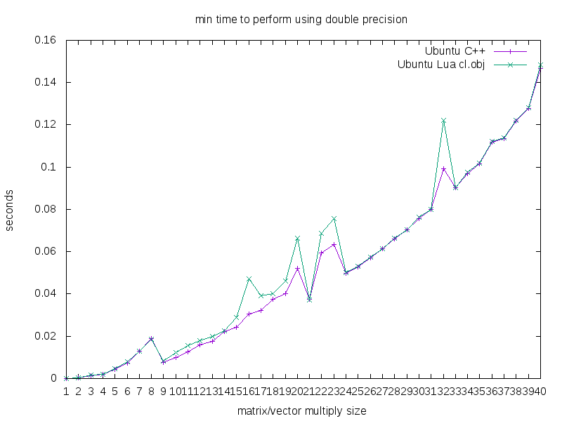

Performance testing my [lua-opencl](https://github.com/thenumbernine/lua-opencl) framework.

Performs a dense matrix multiply at each point in a 256 x 256 grid with local size 16 x 16.

Below is the minimum time taken from 200 samples.

Results:

